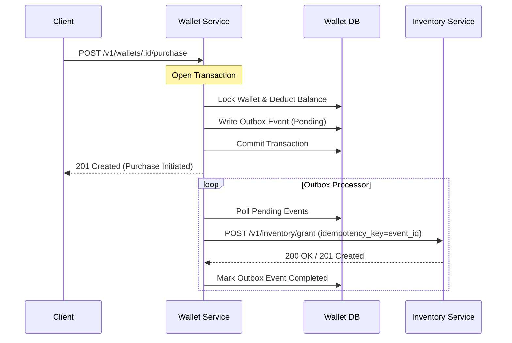

# Resilience and Distributed Systems Design

This document details the architectural patterns and mitigation strategies designed to handle partial failures, distributed transactions, and data reconciliation without downtime.

---

## 1. Distributed Item Grant (Out-of-Transaction)

When the **item grant** moves to a separate inventory service, we cannot span a single database transaction across both services. To achieve **exactly-once purchase processing** end-to-end, we employ the **Transactional Outbox Pattern** combined with **Idempotent Retry Consumers**.

### The Architecture
1. **Local Transaction (Atomic)**:
   - Debit the player's wallet.
   - Insert an outbox event (e.g., `inventory_grant_pending`) in the same database transaction.
   - Commit the transaction. This guarantees that balance is deducted *only if* the intent to grant the item is persistently stored.
2. **Asynchronous Dispatch**:
   - A background worker polls the outbox table (or listens via PostgreSQL `LISTEN/NOTIFY`) and calls the Inventory Service API.
   - The payload sent to the Inventory Service includes an `event_id` or `idempotency_key` derived from the outbox entry.
3. **Idempotent Inventory Service**:
   - The Inventory Service records the processed `event_id` / `idempotency_key`.
   - If the request is retried due to network timeouts, the Inventory Service detects the duplicate key and returns the successful response without granting the item again.
4. **Resolution (Mark Outbox)**:
   - Once the Inventory Service confirms the grant (via `2xx` response), the background worker marks the outbox event as `completed`.



### The Partial-Failure Window
- **Timeout after Debit**: If the background worker fails to reach the Inventory Service, the client receives a success response for the purchase, but the item is not immediately in their inventory.
- **Handling**: The outbox worker continuously retries until it receives a success (or a deterministic business rejection, e.g., item deleted). This guarantees eventual consistency.

---

## 2. Detecting and Correcting Currency Double-Grants

If a bug double-granted currency to some players last week, we must detect and remediate it live without downtime.

### Audit Invariant
Our audit trail ensures that at any point:
$$\text{Wallet Balance} = \sum(\text{Credits}) - \sum(\text{Debits})$$

Every balance modification must correspond to a row in the `wallet_transactions` table.

### Detection
To detect discrepancies and double-grants:
1. **Scan for Duplicate Idempotency Keys or Request Hashes**:
   ```sql
   SELECT player_id, reference_id, count(*) 
   FROM wallet_transactions 
   WHERE transaction_type = 'credit'
   GROUP BY player_id, reference_id
   HAVING count(*) > 1;
   ```
2. **Reconciliation Query**:
   Compare the current balance of the wallet with the sum of all transaction records:
   ```sql
   SELECT w.player_id, w.balance, COALESCE(SUM(t.amount), 0) AS calculated_balance
   FROM wallets w
   LEFT JOIN wallet_transactions t ON w.player_id = t.player_id
   GROUP BY w.player_id, w.balance
   HAVING w.balance != COALESCE(SUM(t.amount), 0);
   ```

### Correction Strategy (Zero Downtime)
1. **Correction Script**:
   - For affected players, execute a database transaction that:
     1. Locks the player's wallet (`SELECT ... FOR UPDATE`).
     2. Calculates the over-credited amount.
     3. Inserts a negative correction entry (`wallet_transactions`) with `reason: 'RECONCILIATION_CORRECTION_BUG_JULY_01'`.
     4. Deducts the amount from the wallet balance.
2. **Handling Negative Balance**:
   - If the player has already spent the double-granted currency, the correction might drive their balance negative.
   - **Decision**: Allow the balance to go negative *temporarily* in the correction transaction (by bypassing the database constraint check specifically for the reconciliation script, or temporarily allowing negative balances for recovery), or cap the deduction to bring their balance to `0` and record the remainder as a "pending debt" to be deducted from future earnings. Capping the balance to `0` and keeping a debit pending is the safest approach to maintain the database invariant `balance >= 0`.
